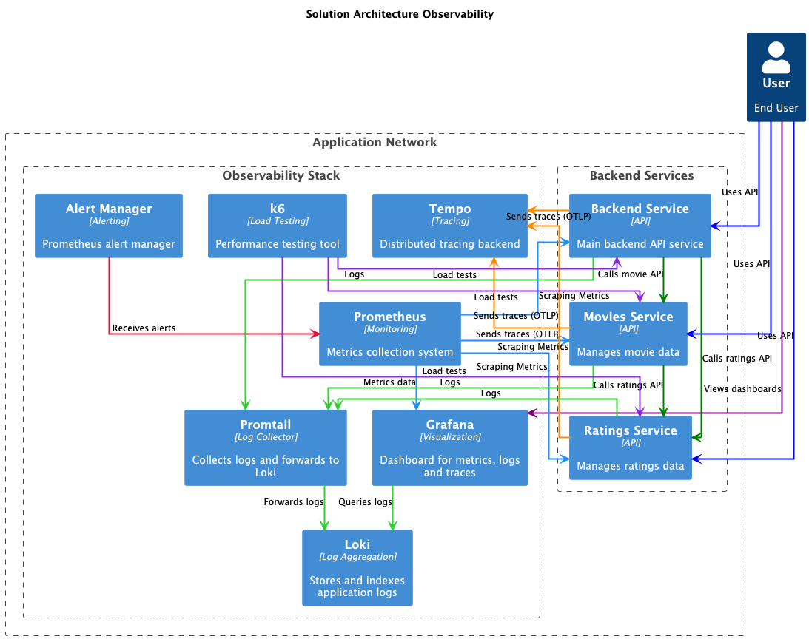

## 🛠️ Observability

Proyek ini adalah contoh penerapan observability (kemampuan untuk mengamati dan memantau sistem) dalam sebuah aplikasi
berbasis microservice menggunakan .NET, Prometheus, Grafana, Loki, dan tools pendukung lainnya. Tujuan utama dari proyek ini
adalah agar kamu bisa belajar bagaimana cara memantau performa dan log aplikasi agar sistem menjadi lebih andal.

## 

## 🎯 Tujuan Utama

- Memantau performa aplikasi secara real-time
- Mendeteksi dan merespons masalah secepat mungkin
- Mengumpulkan dan menganalisis log aplikasi secara terpusat
- Menguji beban trafik dengan tool khusus
- Menampilkan data monitoring secara visual agar mudah dipahami

---

## 🧱 Komponen Utama

| Komponen                                      | Fungsi                                                                       |
| --------------------------------------------- | ---------------------------------------------------------------------------- |
| [**.NET Backend**](./backend/README.md)       | Aplikasi API sederhana untuk dimonitor                                       |
| [**Movies Service**](./movies/README.md)      | Service penyedia data movie, saling terhubung dengan ratings dan backend     |
| [**Ratings Service**](./ratings/README.md)    | Service penyedia data rating untuk aplikasi                                  |
| [**Tempo**](./tempo/README.md)                | Distributed tracing untuk observabilitas aplikasi                            |
| [**Prometheus**](./prometheus/README.md)      | Mengumpulkan data metrik dari aplikasi                                       |
| [**Grafana**](./grafana/README.md)            | Menampilkan metrik dan log dalam bentuk grafik yang mudah dibaca             |
| [**Alertmanager**](./alert-manager/README.md) | Mengirim notifikasi saat ada error/kondisi tidak normal                      |
| [**Loki**](./loki/config.yml)                 | Menyimpan log container secara efisien dan terpusat                          |
| [**Promtail**](./promtail/config.yml)         | Mengumpulkan log dari container dan mengirim ke Loki                         |
| [**K6**](./k6/README.md)                      | Mengirim trafik buatan ke API untuk mentriger alert & record rule prometheus |
| [**Docker Compose**](./DOCKER-COMPOSE.md)     | Menjalankan semua komponen di atas dalam container yang terisolasi           |

---

## 📁 Struktur Folder

```
observability/
├── backend/               # Aplikasi .NET API
├── movies/                # Service penyedia data movie
├── ratings/               # Service penyedia data rating
├── prometheus/            # Konfigurasi Prometheus
├── grafana/               # Konfigurasi & Dashboard Grafana
├── alert-manager/         # Konfigurasi Alertmanager
├── loki/                  # Konfigurasi Loki
├── promtail/              # Konfigurasi Promtail
├── tempo/                 # Konfigurasi Tempo
├── k6/script.js           # Script untuk testing load menggunakan K6
├── docker-compose.yml     # File untuk menjalankan semua layanan
```

---

## 🧪 Cara Menjalankan Proyek Ini

### 1. Pastikan Software Berikut Sudah Terinstal

- [Docker & Docker Compose](https://docs.docker.com/get-docker/)
- [.NET SDK (opsional, hanya jika ingin run backend secara lokal)](https://dotnet.microsoft.com/en-us/download)

### 2. Jalankan Semua Komponen

```shell
docker compose up -d
```

---

## 🌐 Akses Dashboard & Layanan

| Layanan         | URL Lokal                                      | Keterangan                                 |
| --------------- | ---------------------------------------------- | ------------------------------------------ |
| Grafana         | [http://localhost:3000](http://localhost:3000) |                                            |
| Prometheus      | [http://localhost:9090](http://localhost:9090) | Query metrik langsung                      |
| Alertmanager    | [http://localhost:9093](http://localhost:9093) | Lihat alert yang aktif                     |
| Loki API        | [http://localhost:3100](http://localhost:3100) | Endpoint data log (digunakan oleh Grafana) |
| .NET Backend    | [http://localhost:5001](http://localhost:5001) | API utama yang dimonitor                   |
| Movies Service  | [http://localhost:5002](http://localhost:5002) | Service penyedia data movie                |
| Ratings Service | [http://localhost:5003](http://localhost:5003) | Service penyedia data rating               |

---

## 📊 Visualisasi di Grafana

Grafana sudah diatur otomatis untuk menampilkan dashboard:
• Dashboard File: [**grafana/dashboards/app-dashboard.json**](./grafana/dashboards/app-dashboard.json)
• Data Source:

- `Prometheus`: untuk metrik
- `Tempo`: untuk tracing
- `Loki`: untuk log container

---

## 📝 Melihat Log di Grafana (via Loki)

1. Masuk ke Grafana → **Explore**
2. Pilih Data Source: `Loki`
3. Coba query log dari container:

```logql
{job="docker"}
```

Atau filter berdasarkan nama container:

```logql
{container_name=~"backend|movies|ratings"}
```

---

## 📥 Load Testing dengan K6

Untuk memicu alert dan melihat performa:

```shell
docker compose logs k6 -f
```

---

## 🧠 Bagaimana Cara Kerjanya?

1. Backend (.NET) menerima request.
2. Prometheus mengambil metrik dari aplikasi.
3. Promtail membaca log dari container dan mengirim ke Loki.
4. Grafana menampilkan metrik dan log dari Prometheus & Loki.
5. Tempo mengumpulkan tracing distribusi via OpenTelemetry.
6. Alertmanager mengirim notifikasi jika ada kondisi abnormal.
7. K6 digunakan untuk mengirim trafik buatan ke API.

---

## 📚 Referensi

- [OpenTelemetry](https://opentelemetry.io/docs/)
- [Prometheus](https://prometheus.io/docs/)
- [Grafana](https://grafana.com/docs/)
- [Loki](https://grafana.com/docs/loki/latest/)
- [Promtail](https://grafana.com/docs/loki/latest/clients/promtail/)
- [Alertmanager](https://prometheus.io/docs/alerting/latest/alertmanager/)
- [Tempo](https://grafana.com/docs/tempo/latest/)
- [K6](https://k6.io/docs/)
- [Docker Compose](https://docs.docker.com/compose/)

---

⚠️ Jika anda menggunakan Azure API Management, pastikan untuk mengatur policy untuk mengirim header `x-request-id` dll agar tracing dapat berfungsi dengan baik.

- [APIM Policy](./policy.xml)

⸻

🙌 Kontribusi

Pull request dan feedback sangat diterima! Jangan ragu untuk eksplorasi dan berbagi insight!

⸻

📄 License

Proyek ini open-source dan bebas digunakan untuk belajar dan eksperimen.
