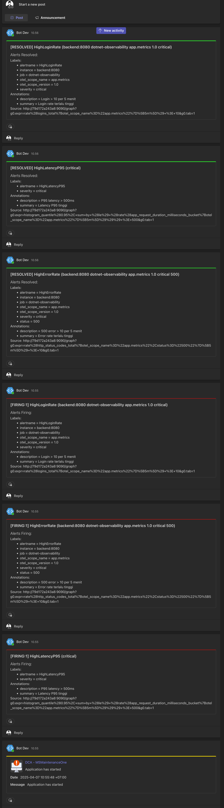

# Setup Alertmanager

## Deskripsi

Pada folder ini berisi file konfigurasi untuk Alertmanager, yang digunakan untuk mengelola pemberitahuan yang dikirimkan oleh Prometheus. Alertmanager menerima pemberitahuan dari Prometheus dan dapat mengirimkan alert ke berbagai saluran, seperti email, Slack, atau webhook.

File yang Tersedia

1. alert-manager-example.yml  
   •	`Deskripsi`: File ini adalah contoh konfigurasi untuk Alertmanager. Di dalamnya, Anda dapat mengonfigurasi penerima pemberitahuan, pengaturan grup pemberitahuan, dan aturan pengiriman alert.
   Bagian Penting  
   •	`global`: Pengaturan global seperti pengaturan waktu pemberitahuan.  
   •	`receivers`: Daftar penerima pemberitahuan, seperti email, Slack, atau webhook.  
   •	`route`: Menentukan bagaimana pemberitahuan dirutekan ke penerima.

Contoh cuplikan:

```yaml
global:
resolve_timeout: 5m

route:
group_by: ['alertname']
receiver: 'email-config'

receivers:
- name: 'email-config'
  email_configs:
    - to: 'your-email@example.com'
      from: 'alertmanager@example.com'
      smarthost: 'smtp.example.com:587'
      auth_username: 'your-username'
      auth_password: 'your-password'
      require_tls: true
```

Penjelasan:  
•	`resolve_timeout`: Menentukan waktu tunggu untuk menyelesaikan alert yang telah diperbaiki.  
•	`route`: Aturan yang mengonfigurasi pengelompokan dan pengiriman alert. Di sini, pemberitahuan akan dikirim ke email-config.  
•	`receivers`: Penerima pemberitahuan, dalam hal ini menggunakan pengaturan email untuk mengirimkan pemberitahuan ke alamat yang ditentukan.

⸻

## Cara Penggunaan
1.	Instalasi Alertmanager:  
•	Pastikan Anda sudah menginstal Alertmanager. Anda dapat mengunduhnya dari situs resmi Alertmanager.
2.	Menyalin File Konfigurasi:  
•	Salin file alert-manager-example.yml ke direktori konfigurasi Alertmanager Anda.
3.	Menjalankan Alertmanager:  
•	Setelah file konfigurasi disalin, Anda dapat menjalankan Alertmanager dengan perintah berikut:
```shell 
alertmanager --config.file=alert-manager-example.yml
```
4.	Mengonfigurasi Prometheus untuk Mengirim Alert ke Alertmanager:  
	•	Anda perlu mengonfigurasi Prometheus untuk mengirim pemberitahuan ke Alertmanager. Tambahkan konfigurasi berikut dalam file prometheus.yml di bagian alerting:

```yaml
alerting:
alertmanagers:
- static_configs:
- targets: ['localhost:9093']
```  
   • `localhost:9093` adalah alamat default di mana Alertmanager berjalan. Sesuaikan jika Anda menjalankan Alertmanager di server lain.
5.	Verifikasi Pemberitahuan:  
	•	Setelah Alertmanager berjalan, Anda dapat memverifikasi bahwa pemberitahuan diterima oleh penerima yang telah dikonfigurasi (misalnya, email).

Catatan  
•	Pastikan Alertmanager dan Prometheus dapat saling berkomunikasi. Jika menggunakan Docker, pastikan kedua aplikasi berada dalam jaringan yang sama.  
•	Sesuaikan pengaturan penerima dalam file alert-manager-example.yml sesuai dengan saluran pemberitahuan yang Anda inginkan (misalnya, email, Slack, dll.).

Dengan konfigurasi ini, Alertmanager akan menerima pemberitahuan dari Prometheus dan mengirimkan alert ke penerima yang ditentukan, seperti email. Apakah ada hal lain yang perlu dijelaskan lebih lanjut atau ditambahkan dalam konfigurasi ini? 

