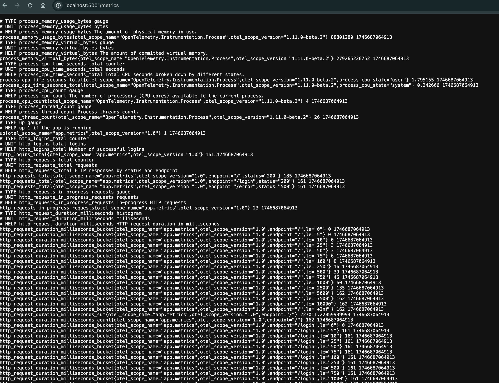
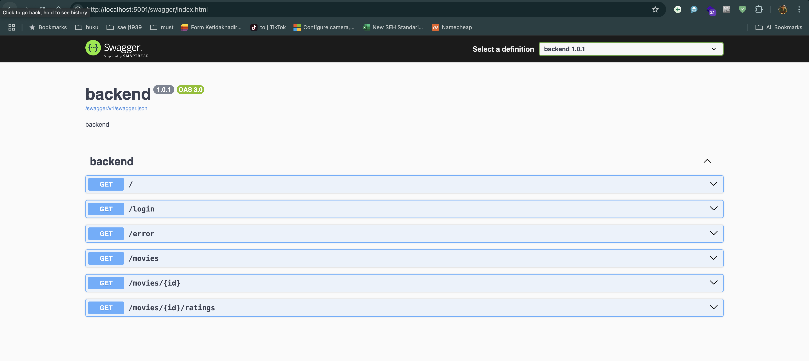

# 🎬 Backend Project / Movies API Gateway with OpenTelemetry Monitoring

Proyek ini merupakan API Gateway sederhana berbasis .NET 8 yang menyediakan endpoint untuk data film serta pemantauan observabilitas tingkat lanjut menggunakan **OpenTelemetry**.

## 🚀 Fitur

- Endpoint RESTful untuk data film dan rating.
- Tracing dan metrics dengan OpenTelemetry (gRPC & Prometheus).
- Integrasi Health Check untuk kebutuhan Kubernetes (readiness dan liveness).
- Middleware khusus untuk pencatatan metrik durasi request.
- Swagger UI untuk dokumentasi interaktif.

## ⚙️ Teknologi dan Library

- ASP.NET Core Minimal API
- `OpenTelemetry.Trace`
- `OpenTelemetry.Metrics`
- `OpenTelemetry.Exporter.Otlp`
- `Prometheus Exporter`
- `HealthChecks` dari ASP.NET Core
- `Swashbuckle.AspNetCore` (Swagger)

## 🗂️ Struktur Proyek

```
.
├── Program.cs                      # Entry point utama, konfigurasi pipeline, middleware, metrics
├── HealthCheckHandlers.cs         # Konfigurasi dan endpoint health check
├── AddObservabilityHandler.cs     # Konfigurasi observability & middleware
├── TracingHeaderHandler.cs        # Handler untuk meneruskan header tracing antar service
├── UpstreamAppInfoTracingMiddleware.cs        # Handler untuk tag span dengan informasi upstream app
├── Models/
│   ├── MoviesApiOptions.cs        # Konfigurasi base URL Movies API
│   ├── MovieVm.cs                 # View model data film
│   ├── RatingVm.cs                # View model data rating
│   ├── MovieWithRatings.cs        # Extend MovieVm untuk menyertakan rating
│   └── OpenTelemetryOptions.cs    # Model konfigurasi OpenTelemetry
├── IMoviesApiClient.cs            # Interface klien Movies API
├── MoviesApiClient.cs             # Implementasi HTTP client untuk Movies API
├── appsettings.json               # Konfigurasi default
├── appsettings.Development.json   # Konfigurasi untuk lingkungan pengembangan
```

## 📊 OpenTelemetry Observability

- **Tracing**: Menggunakan OTLP exporter ke endpoint gRPC (default: `http://localhost:4317`)
- **Metrics**:
   - `http_requests`: jumlah permintaan HTTP berdasarkan status & endpoint
   - `http_request_duration`: durasi permintaan HTTP (histogram)
   - `http_requests_in_progress`: gauge permintaan aktif
   - `http_logins`: jumlah login berhasil
   - `up`: status aplikasi
- **Prometheus scraping**: tersedia di `/metrics`

## 🔌 Endpoint API

| Method | Endpoint                    | Deskripsi                    |
|--------|-----------------------------|------------------------------|
| GET    | `/`                         | Cek status API (Hello World) |
| GET    | `/login`                    | Simulasi login               |
| GET    | `/error`                    | Simulasi error 500           |
| GET    | `/movies`                   | Ambil semua data film        |
| GET    | `/movies/{id}`             | Ambil data film by ID        |
| GET    | `/movies/{id}/ratings`     | Ambil rating dari film       |
| GET    | `/health/ready`            | Endpoint readiness check     |
| GET    | `/health/live`             | Endpoint liveness check      |
| GET    | `/metrics`                 | Endpoint Prometheus metrics  |
| GET    | `/swagger`                 | UI dokumentasi interaktif    |

## 📦 Konfigurasi

Edit file `appsettings.json` atau `appsettings.{Environment}.json`:

```json
{
  "MoviesApi": {
  "BaseUrl": "http://localhost:5001"
  },
  "OpenTelemetry": {
    "Otlp": {
      "Endpoint": "http://localhost:4317"
    },
    "Exporters": {
      "Traces": "otlp",
      "Metrics": "prometheus"
    },
    "ResourceAttributes": {
      "ServiceName": "movies-gateway",
      "ServiceVersion": "1.0.0"
    }
  }
}
```

## 🏁 Menjalankan Proyek

```bash
dotnet run
```

Lalu akses:  
•	http://localhost:5164/swagger  
•	http://localhost:5164/metrics  
•	http://localhost:5164/health/ready  
•	http://localhost:5164/health/live



