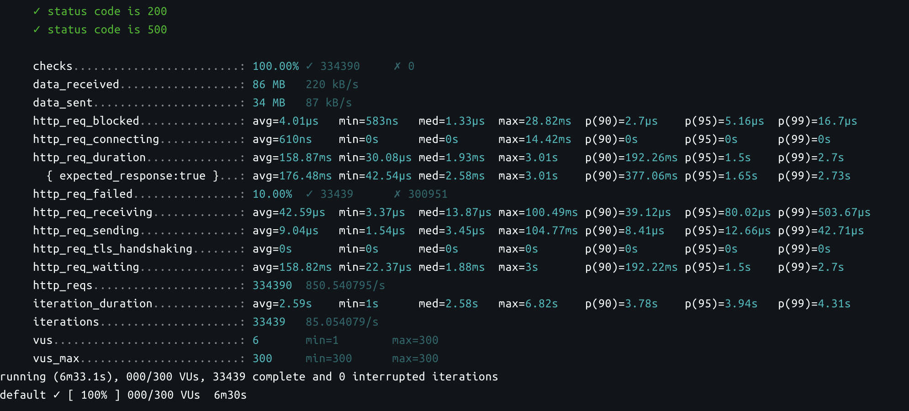
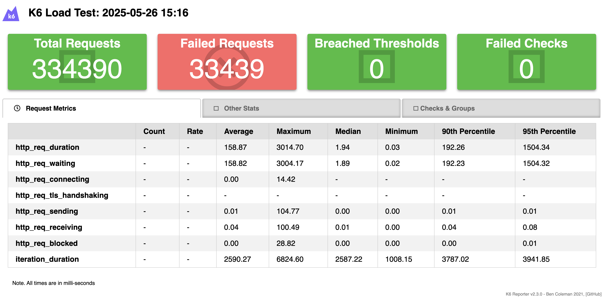

# k6 Load Testing Script

## Deskripsi

Skrip ini digunakan untuk menguji beban aplikasi backend yang berjalan di alamat http://backend:8080. Menggunakan k6,
skrip ini mengirimkan permintaan HTTP ke beberapa endpoint aplikasi untuk memverifikasi bahwa aplikasi merespons dengan
benar pada berbagai tingkat beban. Skrip ini menguji tiga endpoint utama:

1. / - Endpoint dasar aplikasi.
2. /login/ - Endpoint login aplikasi.
3. /error/ - Endpoint yang mengembalikan error 500.

Skrip ini bertujuan untuk melakukan pengujian beban (load testing) pada aplikasi dengan simulasi peningkatan jumlah
pengguna yang mengakses aplikasi selama periode waktu tertentu.

Instalasi

1. Instalasi k6  
   • Pastikan Anda sudah menginstal k6 di mesin Anda. Anda dapat menginstalnya dengan mengikuti panduan resmi di k6
   Documentation.
2. Menjalankan Skrip  
   • Setelah k6 terinstal, jalankan skrip ini menggunakan perintah berikut:

```shell
k6 run script.js
```

Struktur Skrip

1. Deklarasi Dependensi  
   • Skrip ini menggunakan dua modul dari k6:  
   • http untuk membuat permintaan HTTP.  
   • check untuk memverifikasi status respons.  
   • sleep untuk menunda eksekusi antara permintaan.
   • htmlReport & textSummary untuk menggenerate.

```js
import { htmlReport } from "https://raw.githubusercontent.com/benc-uk/k6-reporter/main/dist/bundle.js";
import { textSummary } from "https://jslib.k6.io/k6-summary/0.0.1/index.js";
import http from 'k6/http';
import { check, sleep } from 'k6';
```

2. Backend Host  & generateTracingHeaders 
   • Alamat backend yang diuji diset ke http://localhost:5164 dalam variabel backend_HostAddress.
   • Alamat movies yang diuji diset ke http://localhost:5185 dalam variabel movie_HostAddress.
   • Alamat ratings yang diuji diset ke http://localhost:5272 dalam variabel rating_HostAddress.

```js
const backend_HostAddress = __ENV.BACKEND_URL || "http://localhost:5164"
const movie_HostAddress = __ENV.MOVIE_URL || "http://localhost:5185"
const rating_HostAddress = __ENV.RATING_URL || "http://localhost:5272"
function generateTracingHeaders() {
   const traceId = uuidv4().replace(/-/g, "").substring(0, 16); // 16-char hex
   const spanId = uuidv4().replace(/-/g, "").substring(0, 16);

   return {
      Accept: 'application/json',
      'x-request-id': uuidv4(),
      'x-b3-traceid': traceId,
      'x-b3-spanid': spanId,
      'x-b3-sampled': '1',
      'x-b3-flags': '0',
      'x-ot-span-context': uuidv4()
   };
}
```

3. Fungsi makeRequests  
   • Fungsi ini mengirimkan permintaan GET ke tiga endpoint:  
   • /: Memverifikasi bahwa respons memiliki status 200 (OK) dari backend.  
   • /login/: Memverifikasi bahwa respons memiliki status 200 (OK) dari backend.  
   • /error/: Memverifikasi bahwa respons memiliki status 500 (Internal Server Error) dari backend.  
   • /movies/: Memverifikasi bahwa respons memiliki status 200 (Ok).  
   • /movies/1: Memverifikasi bahwa respons memiliki status 200 (Ok) dari backend.  
   • /movies/1/ratings: Memverifikasi bahwa respons memiliki status 200 (Ok) dari backend.  
   • /: Memverifikasi bahwa respons memiliki status 200 (Ok) dari movies.  
   • /1: Memverifikasi bahwa respons memiliki status 200 (Ok) dari movies.  
   • /1/ratings: Memverifikasi bahwa respons memiliki status 200 (Ok) dari movies.  
   • /1/: Memverifikasi bahwa respons memiliki status 200 (Ok) dari ratings.  
   • /1/ratings: Memverifikasi bahwa respons memiliki status 200 (Ok) dari movies.  
   • /1: Memverifikasi bahwa respons memiliki status 200 (Ok) dari ratings.  

```js function makeRequests() {

function makeRequests() {
   const headers = generateTracingHeaders();
   const randomNumber = Math.floor(Math.random() * 4) + 1;

   let res = http.get(`${backend_HostAddress}/`, { headers });
   check(res, { 'status code is 200': (r) => r.status === 200 });

   res = http.get(`${backend_HostAddress}/login/`, { headers });
   check(res, { 'status code is 200': (r) => r.status === 200 });

   res = http.get(`${backend_HostAddress}/error/`, { headers });
   check(res, { 'status code is 500': (r) => r.status === 500 });

   res = http.get(`${backend_HostAddress}/movies/`, { headers });
   check(res, { 'status code is 200': (r) => r.status === 200 });

   res = http.get(`${backend_HostAddress}/movies/${randomNumber}`, { headers });
   check(res, { 'status code is 200': (r) => r.status === 200 });

   res = http.get(`${backend_HostAddress}/movies/${randomNumber}/ratings`, { headers });
   check(res, { 'status code is 200': (r) => r.status === 200 });

   res = http.get(`${movie_HostAddress}/${randomNumber}`, { headers });
   check(res, { 'status code is 200': (r) => r.status === 200 });

   res = http.get(`${movie_HostAddress}/${randomNumber}/ratings`, { headers });
   check(res, { 'status code is 200': (r) => r.status === 200 });

   res = http.get(`${rating_HostAddress}/${randomNumber}`, { headers });
   check(res, { 'status code is 200': (r) => r.status === 200 });

   res = http.get(`${rating_HostAddress}/${randomNumber}`, { headers });
   check(res, { 'status code is 200': (r) => r.status === 200 });
}
```

4. Fungsi Utama  
   • Fungsi default ini menjalankan makeRequests() dan menunggu selama 1 detik antara setiap iterasi.

```js
export default function () {
    makeRequests();
    sleep(1);
}
```

5. Pengaturan Load Testing  
   • options mendefinisikan pengaturan untuk uji beban:  
   • stages mendefinisikan bagaimana jumlah pengguna akan bertambah seiring waktu.  
   • summaryTrendStats menentukan statistik yang akan dilaporkan setelah pengujian selesai.  
```js 
export const options = {
    stages: [
        {duration: '1m', target: 100},
        {duration: '1m', target: 200},
        {duration: '1m', target: 300},
        {duration: '3m', target: 300},
        {duration: '30s', target: 0}
    ],
    summaryTrendStats: ['avg', 'min', 'med', 'max', 'p(90)', 'p(95)', 'p(99)'],
};
```
6. Stages  
   • Skrip ini memiliki beberapa tahap pengujian beban:  
   • 1 menit dengan 100 pengguna.  
   • 1 menit dengan 200 pengguna.  
   • 1 menit dengan 300 pengguna.  
   • 3 menit dengan 300 pengguna (menjaga beban pada 300).  
   • 30 detik dengan 0 pengguna (mengurangi pengguna secara bertahap).
7. Summary Trend Stats  
   • Setelah pengujian selesai, skrip ini melaporkan statistik berikut:  
   • Rata-rata (avg)  
   • Minimum (min)  
   • Median (med)  
   • Maksimum (max)  
   • Persentil 90 (p(90))  
   • Persentil 95 (p(95))  
   • Persentil 99 (p(99))
8. Laporan HTML  
   • Skrip ini menghasilkan laporan HTML menggunakan htmlReport dari k6-reporter.  
   • Laporan ini akan disimpan dalam file `result.htmll` setelah pengujian selesai.

```js
export function handleSummary(data) {
   return {
      "/results/result.html": htmlReport(data),
      stdout: textSummary(data, { indent: " ", enableColors: true }),
   };
}
```

## Tujuan Pengujian

Skrip ini bertujuan untuk melakukan pengujian beban pada aplikasi backend, termasuk:  
• Memastikan endpoint utama aplikasi merespons dengan benar (status 200 untuk endpoint umum dan login, status 500 untukerror).  
• Mengukur latensi respons pada setiap endpoint.  
• Memantau kinerja aplikasi saat beban pengguna meningkat dari 100 hingga 300 pengguna.
• Mentriger alert & record rule prometheu

## Hasil Pengujian

Setelah menjalankan skrip, k6 akan memberikan hasil pengujian beban yang mencakup:  
• Waktu respons rata-rata (avg), minimum, median, dan maksimum.  
• Persentil waktu respons (p(90), p(95), p(99)).  
• Jumlah permintaan yang berhasil dan jumlah kegagalan.
• dan laporan HTML yang berisi ringkasan hasil pengujian.


Catatan  
• Pastikan aplikasi backend, movies dan ratings sudah berjalan dan dapat diakses pada http://localhost:5164, http://localhost:5185, http://localhost:5272 (port di sesuakian dengan jika berjalan via docker) sebelum menjalankan pengujian.  


