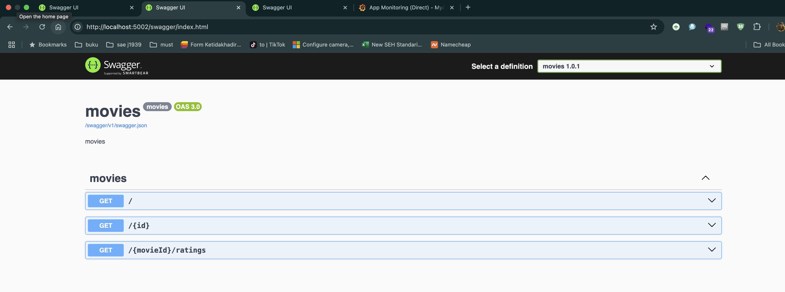

# 🎥 Movies Backend Service with OpenTelemetry & EF Core

Aplikasi backend .NET 8 Minimal API untuk data movie dan rating, menggunakan SQLite sebagai database, serta
observabilitas lengkap menggunakan OpenTelemetry.

## 🚀 Fitur

- Endpoint RESTful untuk data film dan rating.
- Tracing dan metrics dengan OpenTelemetry (gRPC & Prometheus).
- Integrasi Health Check untuk kebutuhan Kubernetes (readiness dan liveness).
- Middleware khusus untuk pencatatan metrik durasi request.
- Swagger UI untuk dokumentasi interaktif.

## ⚙️ Teknologi dan Library

- ASP.NET Core Minimal API
- `OpenTelemetry.Trace`
- `OpenTelemetry.Metrics`
- `OpenTelemetry.Exporter.Otlp`
- `Microsoft.EntityFrameworkCore.Sqlite`
- `Prometheus Exporter`
- `HealthChecks` dari ASP.NET Core
- `Swashbuckle.AspNetCore` (Swagger)

## 🗂️ Struktur Proyek

```
├── Program.cs                  # Entry point & konfigurasi utama
├── AddHealthCheckHandler.cs    # Konfigurasi health check & middleware
├── AddObservabilityHandler.cs    # Konfigurasi observability & middleware
├── MovieDbContext.cs           # EF Core DbContext untuk movies.db
├── RatingsApiClient.cs         # HTTP client untuk Ratings API eksternal
├── TracingHeaderHandler.cs        # Handler untuk meneruskan header tracing antar service
├── UpstreamAppInfoTracingMiddleware.cs        # Handler untuk tag span dengan informasi upstream app
├── Models/
│   ├── Movie.cs                # Entity Movie
│   ├── RatingVM.cs             # Model rating
│   └── OpenTelemetryOptions.cs    # Model konfigurasi OpenTelemetry
├── appsettings.json            # Konfigurasi utama
├── appsettings.Development.json# Konfigurasi development
```

## 📊 Observabilitas OpenTelemetry

- Tracing: OTLP (gRPC) endpoint default `http://localhost:4317`
- Metrics:
    - `http_requests`: jumlah HTTP response per status & endpoint
    - `http_request_duration`: durasi permintaan HTTP (histogram)
    - `http_requests_in_progress`: gauge permintaan aktif
    - `up`: status aplikasi
- Prometheus scraping tersedia di `/metrics`

## 🔌 Endpoint API

| Method | Endpoint        | Deskripsi                   |
|--------|-----------------|-----------------------------|
| GET    | `/`             | List semua film             |
| GET    | `/{id}`         | Detail film berdasarkan ID  |
| GET    | `/{id}/ratings` | Rating film berdasarkan ID  |
| GET    | `/health/ready` | Readiness health check      |
| GET    | `/health/live`  | Liveness health check       |
| GET    | `/metrics`      | Prometheus metrics scraping |
| GET    | `/swagger`      | UI dokumentasi Swagger      |

## 📦 Konfigurasi

Edit file `appsettings.json` atau `appsettings.{Environment}.json`:

```json
{
  "RatingsApi": {
    "BaseUrl": "http://localhost:5002"
    // URL dari Ratings API eksternal 5185
  },
  "OpenTelemetry": {
    "Otlp": {
      "Endpoint": "http://localhost:4317"
    },
    "Exporters": {
      "Traces": "otlp",
      "Metrics": "prometheus"
    },
    "ResourceAttributes": {
      "ServiceName": "movies-backend",
      "ServiceVersion": "1.0.0"
    }
  }
}
```

## 🏁 Menjalankan Proyek

```bash
dotnet run
```

Lalu akses:  
•    http://localhost:5185/swagger  
•    http://localhost:5185/metrics  
•    http://localhost:5185/health/ready  
•    http://localhost:5185/health/live


